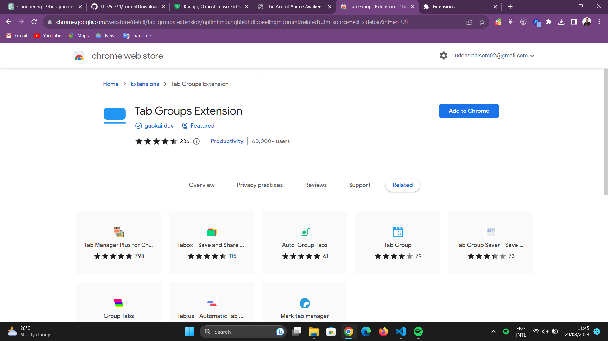
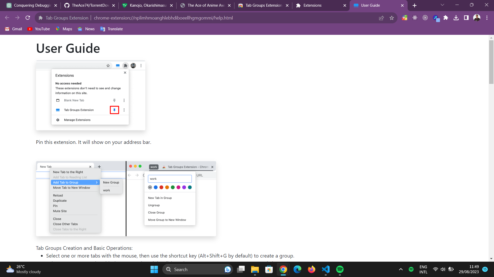

# TorrentDownloader

## Project Overview

The Gogoanime Torrent Downloader is a tool designed to facilitate the download of anime content from the Gogoanime website. It aims to provide a convenient way for users to access their favorite anime shows and episodes for offline viewing.

**Disclaimer:** This project should be used responsibly and in compliance with copyright laws and the terms of use of Gogoanime or any other website from which content is downloaded.


## Features

- **Multiple Quality Options:** Choose from different video quality options based on availability.
- **Batch Download:** Download multiple episodes or even entire series in one go.
- **User-Friendly Interface:** Intuitive interface for easy navigation and usage.

## Installation

1. Clone the TorrentDownloader repository to your local machine.

```bash
git clone https://github.com/TheAce74/TorrentDownloader.git
```

2. Install the required dependencies.

```bash
npm install
```

## Usage

1. Run the development server.

```bash
npm run dev
```

2. Open your preferred web browser and visit `http://localhost:3000` to access the TorrentDownloader.

## Legal and Ethical Considerations

- Ensure you have the legal right to download and distribute the content you access through the tool.
- Respect copyright laws and the terms of use of the websites from which you're downloading content.
- This tool is intended for personal and fair use only.

## Disclaimer

The creator of this project does not endorse or encourage any unauthorized or illegal downloading of copyrighted content. Users of this tool are solely responsible for ensuring their actions comply with applicable laws and regulations.

---

**Note:** Always verify the legality of downloading content from specific websites and adhere to their terms of use. Respect intellectual property rights and use any downloader tool responsibly.

**Extra Note:** Due to certain reasons, one being the dreaded cors policy, the web app doesn't really download; although it helps in making the process of downloading from the official Gogoanime site a lot less tedious

## Desktop Users Only

To make it easier to utilize this web app, I recommend installing the **Tab Groups Extension** from [Chrome Web Store](https://chrome.google.com/webstore/detail/tab-groups-extension/nplimhmoanghlebhdiboeellhgmgommi/related?utm_source=ext_sidebar&hl=en-US).






Before you continue with the setup, ensure you download this [config file](./public/tabgroups_rules_20240102.json).

After installing, you can decide to pin it or not (I prefer pinning my favorite extensions).


Click on the extension's icon.


Click on the **Group Rules** tab.


Select **Edit Rules**, you'll be redirected to a new tab with the caption **Tab Grouping Rules** on its page's body.


Select **Import/Export > Import JSON File**.


A file select dialog window appears, navigate to the directory where the file I instructed to be downloaded earlier is located, and select the said file.


This should be the output of the current window.


**Rare:** If the toggle is disabled, enable it.


### No Need To Worry About Tab Clutter Any More

Now, whenever you use the web app, all tabs related to the output will be grouped. The group can be expanded or collapsed by clicking on the group title, which should be **Gogoanime**.


You can choose to extract it to its own window.


Happy Downloading 💃🎉

**PS:** Minor changes were made to the site due to some changes made in the parent site **Gogoanime**